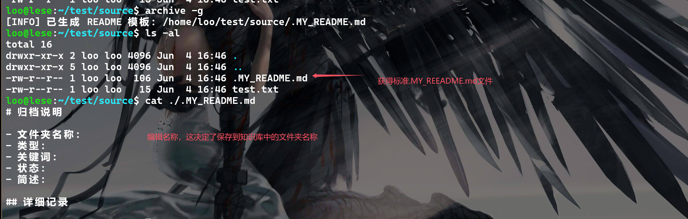
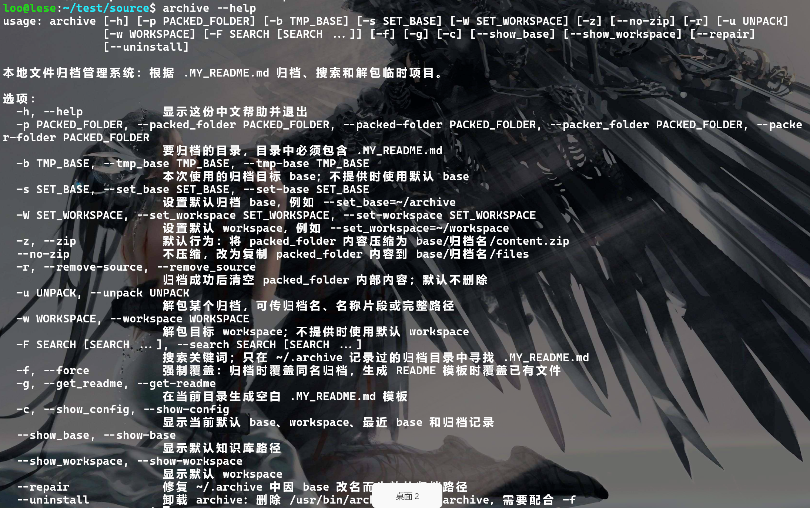

# archive

更好的管理知识库，包括打包，查找，取出等功能

整理零散的知识让人头疼，尤其是当他们互不相干，数量庞大的时候，将其打包放到知识库中是容易的，但想要重新拿出来研究时，会遇到找不到的情况。。。为了避免每次在寻找上面浪费时间，我引入了.MY_README.md文件，想要实现类似高级语言中函数的注释的功能，方便寻找，于是便产生了这个项目
安装和用法都非常简单，希望帮助到有需要的人


## 安装

### linux

```bash
git clone https://github.com/yhbshishuaige/archive.git
cd ./archive
chmod +x ./install.sh
sudo ./install.sh
```

默认安装到`/usr/bin/archive`，但是`install.sh`支持自定义到任何路径，如果只是想要尝试一下的话`./install.sh /your/path`

## 使用

**第一次使用需要设置base和workspace**

```bash
archive --set_base ~/your/base
archive --set_workspace ~/your/workspace
```


**归档**

```bash
# 获得.MY_README.md
archive -g
archive -pf ./
```



**查找**

```bash
archive -F "源码" "文件管理系统"
```


**解包到工作区**

```bash
archive -u /example/path
```


**查看帮助**

```bash
archive --help
```


**当base的名称变化的时候，可以更新.archive中已经保存的路径**

```bash
archive --repair
```

**查看配置**

```bash
archive -c
archive --show_base
archive --show_workspace
```


**删除**

```bash
archive --uninstall -f
```


## `.MY_README.md` 

```markdown
# 归档说明

- 文件夹名称：你希望创建的名称，若为空则会自动创建加上前缀auto_
- 类型：
- 关键词：
- 状态：
- 简述：

## 要求
python版本 >= 3.8

